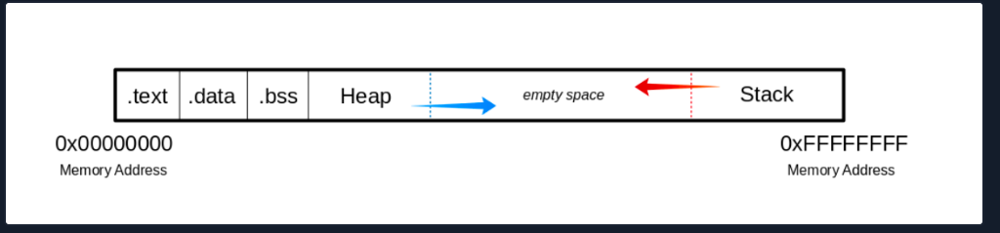
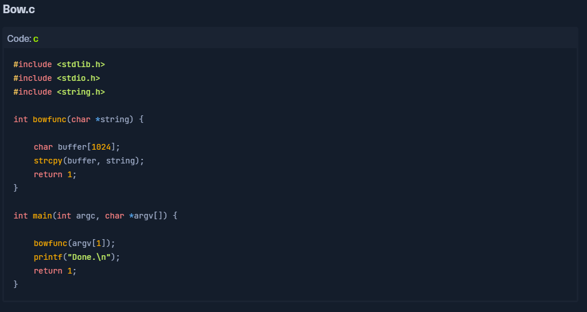
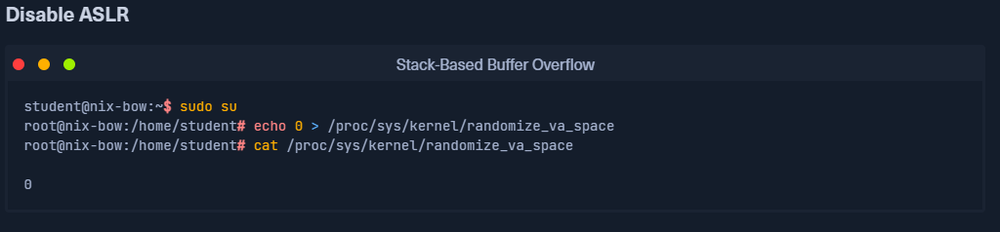
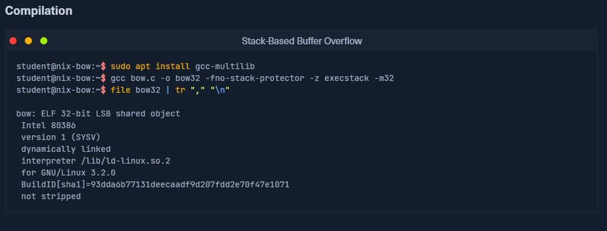
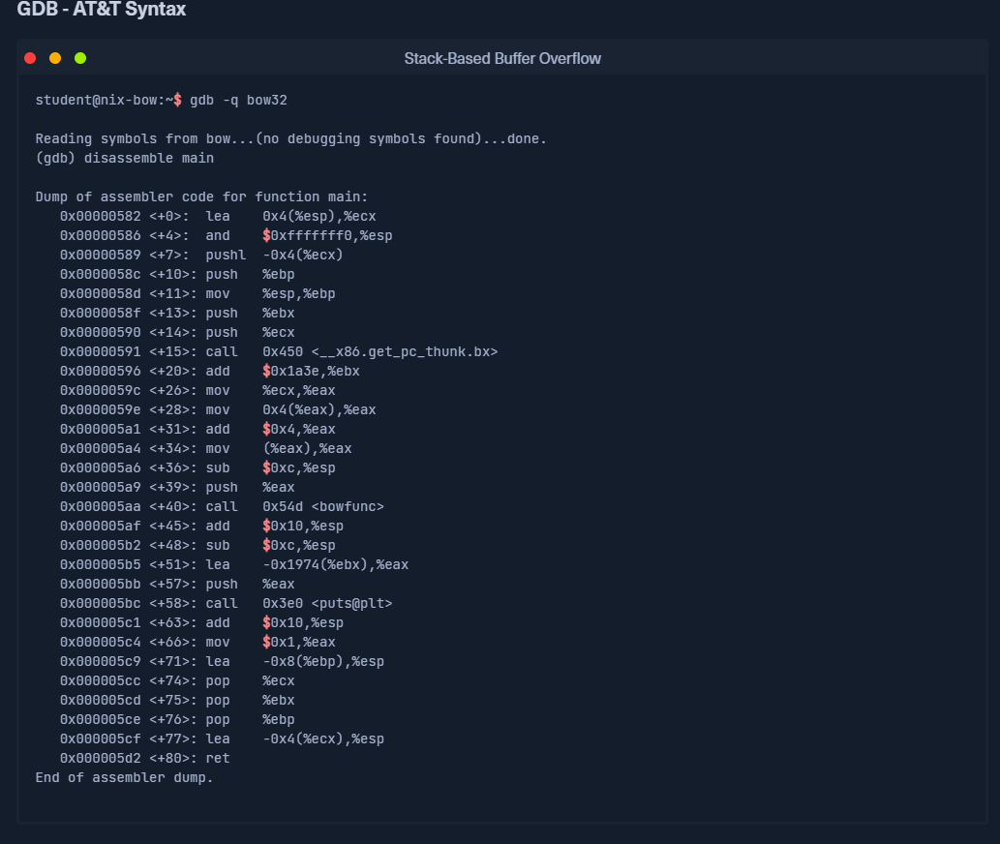
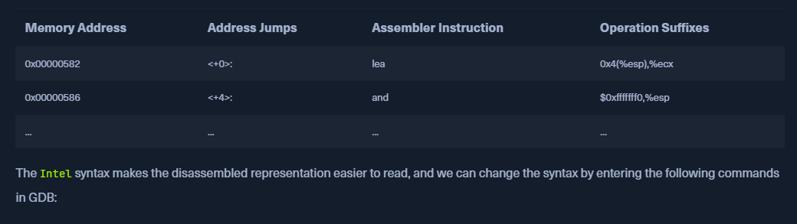
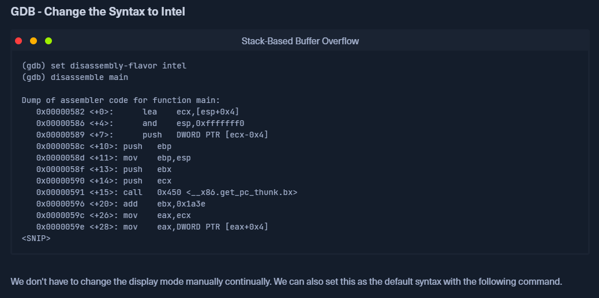
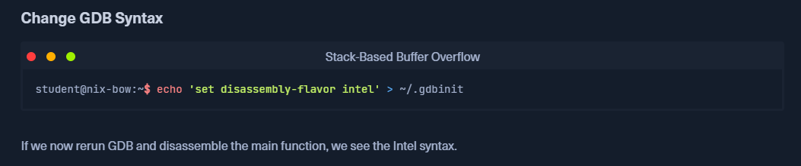
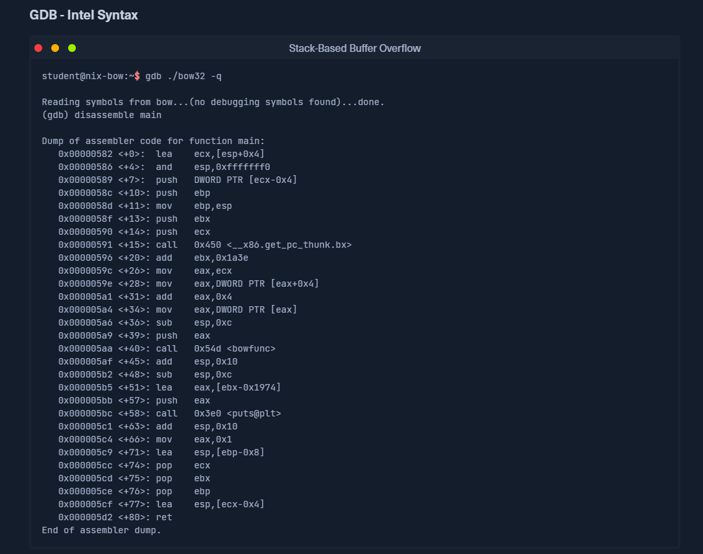
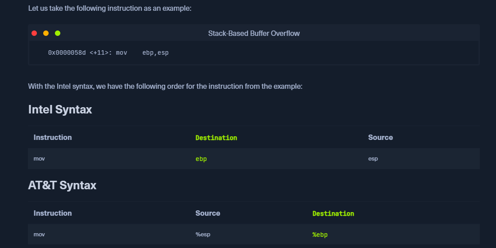

Stack-Based Buffer Overflow

A stack-based buffer overflow is a type of security vulnerability that occurs when a program attempts to write more data to a memory buffer than it can hold. This overflow can overwrite adjacent memory, including critical data like return addresses.

This problem is particularly common in low-level programming languages like C and C++ because they lack built-in memory management and safety checks. When a buffer overflow happens, a malicious actor can manipulate the program's flow by changing the return address, causing the program to execute a different function or even jump to an attacker's own code.

How It Works
Memory Division: When a program runs, its data and instructions are loaded into main memory. This memory is divided into different sections, including a stack, which is used for local variables and function calls.

Return Addresses: The stack stores return addresses, which tell the program where to go after a function finishes.

The Exploit: A buffer overflow can overwrite a return address on the stack. The attacker can then replace this address with one that points to their own malicious code, effectively taking control of the program.

Key Considerations
Exploiting a buffer overflow is often version-specific, meaning the attack will only work on a particular version of a program running on a specific operating system. Because of this, security researchers must often rebuild and reconfigure target systems to match the exact environment where the vulnerability exists. This careful setup is crucial for successful analysis and exploitation.

The Memory
When the program is called, the sections are mapped to the segments in the process, and the segments are loaded into memory as described by the ELF file.

.text
The .text section contains the actual assembler instructions of the program. This area can be read-only to prevent the process from accidentally modifying its instructions. Any attempt to write to this area will inevitably result in a segmentation fault.

.data
The .data section contains global and static variables that are explicitly initialized by the program.

.bss
Several compilers and linkers use the .bss section as part of the data segment, which contains statically allocated variables represented exclusively by 0 bits.

The Heap
Heap memory is allocated from this area. This area starts at the end of the ".bss" segment and grows to the higher memory addresses.

The stack is a section of computer memory that uses a Last-In, First-Out (LIFO) structure. It stores temporary data for running programs, including local variables, function parameters, and return addresses. The stack pointer manages access to this memory, and as a program runs, the stack grows from higher to lower memory addresses.

The stack is a section of computer memory that uses a Last-In, First-Out (LIFO) structure. It stores temporary data for running programs, including local variables, function parameters, and return addresses. The stack pointer manages access to this memory, and as a program runs, the stack grows from higher to lower memory addresses.

Memory Protections and Evasion
Modern operating systems have built-in defenses to prevent stack-based attacks:

Data Execution Prevention (DEP): This protection marks areas of memory, like the stack, as "read-only" to prevent attackers from running malicious code they've injected into the stack.

Address Space Layout Randomization (ASLR): ASLR randomizes where key data is stored in memory, making it difficult for an attacker to predict the location of specific functions or return addresses needed for an attack.

However, hackers have developed ways to bypass these defenses:

Return-Oriented Programming (ROP): Attackers use ROP to bypass DEP by chaining together small snippets of existing, legitimate code (called "gadgets") within the program's executable memory. This allows them to execute their code without needing to write new, executable code on the stack.

Memory Address Leaking: Attackers can sometimes get around ASLR by finding ways to "leak" or reveal memory addresses. This is difficult to do and makes exploits less reliable but is still a possible method for bypassing ASLR.

Vulnerable Program
We are now writing a simple C-program called bow.c with a vulnerable function called strcpy().

Modern operating systems have built-in protections against such vulnerabilities, like Address Space Layout Randomization (ASLR). 

For the purpose of learning the basics of buffer overflow exploitation, we are going to disable this memory protection features:

Next, we compile the C code into a 32bit ELF binary.

gcc bow.c -o bow32 -fno-stack-protector -z execstack -m32

This command uses the GNU Compiler Collection (GCC) to compile the C source code file bow.c into an executable file named bow32. The flags used are crucial for creating a vulnerable program:

-o bow32: Specifies the name of the output executable file.

-fno-stack-protector: Disables a security feature known as a stack protector or stack canary. This makes the program vulnerable to a classic stack-based buffer overflow.

-z execstack: Disables the Data Execution Prevention (DEP) memory protection. This allows code to be executed on the stack, which is a key part of many buffer overflow attacks.

-m32: Compiles the program as a 32-bit executable, even on a 64-bit system. This is a common practice in security labs and exercises because 32-bit architectures are often simpler to analyze for buffer overflow vulnerabilities.

file bow32 | tr "," "\n"

This command inspects the bow32 executable to determine its type and characteristics. The tr command is used to replace commas with newlines, making the output more readable.

The output reveals the following important details:

ELF 32-bit LSB shared object: This confirms that the file is a 32-bit Executable and Linking Format (ELF) file, which is the standard executable format on Linux.

Intel 80386: The executable is compiled for the 32-bit Intel architecture.

dynamically linked: The program relies on shared libraries (e.g., standard C libraries) that are loaded at runtime.

not stripped: The executable still contains debugging symbols, which are useful for reverse engineering and debugging the program's internal structure. This is important for security analysis as it provides more information about the program's functions and variables.

Vulnerable C Functions
There are several vulnerable functions in the C programming language that do not independently protect the memory. Here are some of the functions:

strcpy
gets
sprintf
scanf
strcat

GDB, the GNU Debugger, is a standard debugging tool for Linux systems. It supports multiple programming languages, including C, C++, and Java.

Key Features
Traceability: GDB lets you set breakpoints to pause program execution and view the stack trace to understand the sequence of function calls.

Program Intervention: You can actively manipulate a program's state while it's running. This includes changing the values of variables and even calling functions independently.

Assembly-Level Analysis: GDB is essential for reverse engineering, allowing you to disassemble a program's code to see its low-level assembler instructions.

In the first column, the hexadecimal numbers represent the memory addresses. The numbers with the plus sign (+) show the address jumps in memory in bytes, used for the respective instruction.

Next, we can see the assembler instructions (mnemonics) with registers and their operation suffixes. The current syntax is AT&T, which we can recognize by the % and $ characters.

The difference between the AT&T and Intel syntax is not only in the presentation of the instructions with their symbols but also in the order and direction in which the instructions are executed and read.

